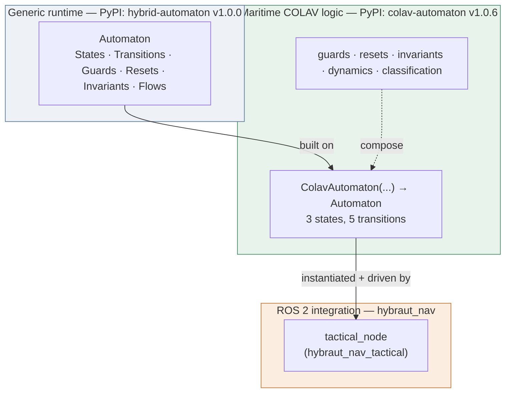
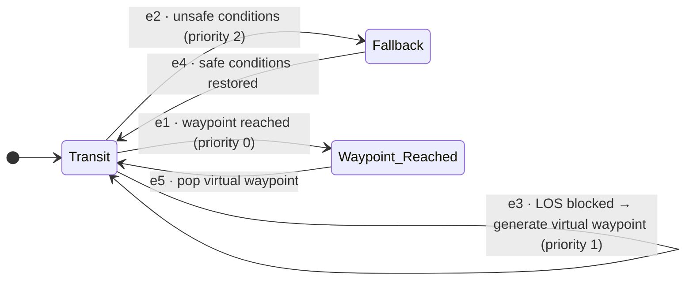
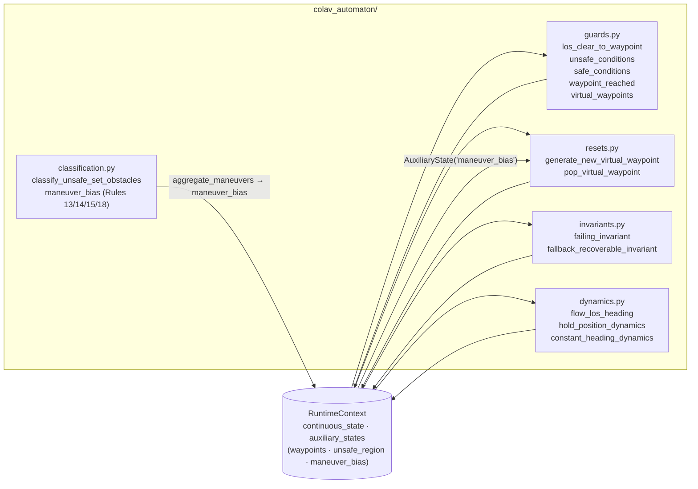
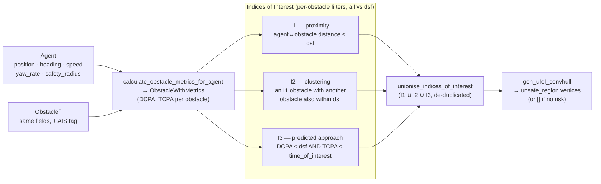
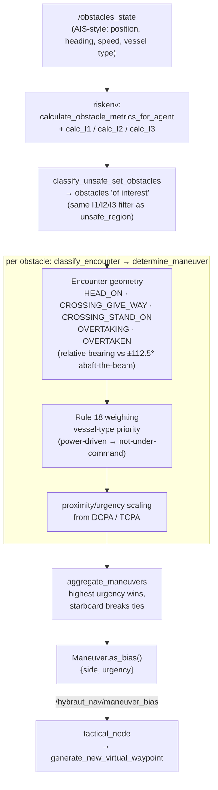
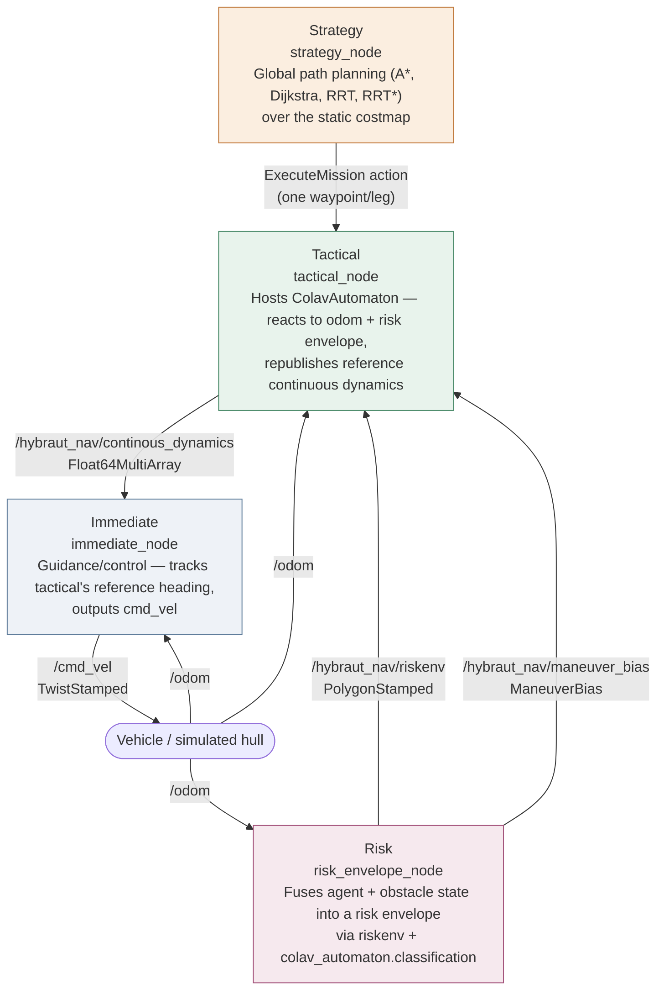
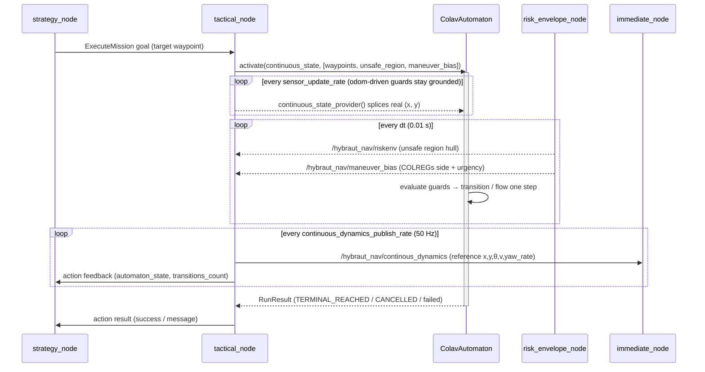
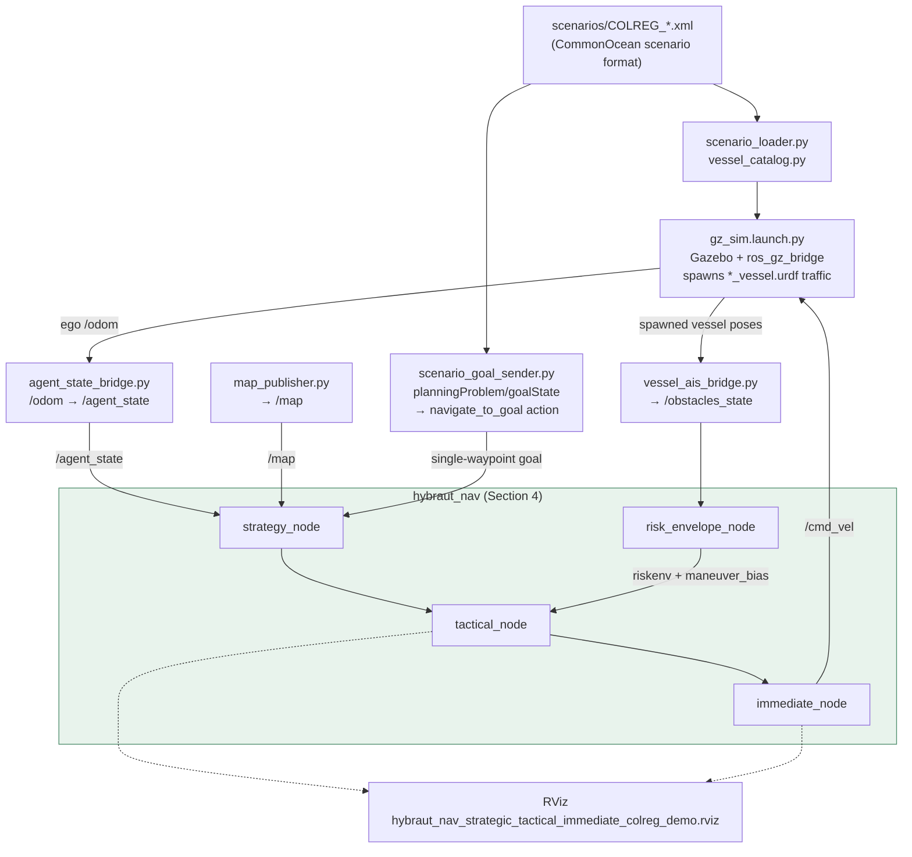

# HybrautNav Architecture

Software tools for maritime autonomy — from the generic `hybrid-automaton`
framework, through the maritime-specific `colav-automaton` (v1.0.6), into the
`hybraut_nav` ROS 2 stack and its `hybraut_nav_colreg_sim` test harness.

---

## 1. Framework stack

Three layers of increasing specificity: a generic hybrid-automaton runtime,
a maritime COLAV automaton built on it, and the ROS 2 stack that runs it
against a live vehicle.

**Key point for discussion:** `hybraut_nav` never touches hybrid-automaton
directly for logic — it depends on it only for the shared types
(`Automaton`, `ContinuousState`, `AuxiliaryState`, `RunResult`). All COLAV
domain logic lives one layer down, in `colav-automaton`.

---

## 2. `colav-automaton` — discrete state machine

The automaton driving the tactical layer. Always "under way" while in
`Transit`; steers on LOS (line-of-sight) guidance and reroutes around the
unsafe region on the fly.

| State | Flow | Behaviour |
|---|---|---|
| **Transit** | `flow_los_heading` | Only "under way" state — always steers via LOS guidance toward the current (real or virtual) waypoint. |
| **Fallback** | `hold_position_dynamics` | Entered when the safety-radius circle intersects the unsafe region. Brakes and holds heading — no active replanning — until `safe_conditions_guard` clears or `fallback_timeout` elapses. |
| **Waypoint_Reached** | `constant_heading_dynamics` | Terminal-ish: pops the next queued virtual waypoint and resumes, or ends the leg if none remain. |

`e3` outranks `e2` on priority (min-wins) so a reroute always gets first
refusal over bracing in Fallback when both guards fire in the same step.

---

## 3. `colav-automaton` — internal module architecture

Every guard / reset / invariant / dynamics function reads and writes the
same shared `RuntimeContext` — the data contract the automaton passes
around each evaluation step.

`classification.py` is the COLREGs layer (since v1.0.4): it scores each
tracked ship's encounter geometry (Rule 13 overtaking, 14 head-on, 15
crossing) weighted by Rule 18 vessel-type right-of-way, and produces a
`{side, urgency}` bias that overrides the automaton's default "easiest
side" geometric heuristic in `generate_new_virtual_waypoint`.

---

## 4. `riskenv` — risk envelope computation

The geometric core feeding both `unsafe_region` and, downstream, COLREGs
classification. Pure CPA/TCPA geometry — no COLREGs knowledge lives here.

| Index | Question it answers | Criterion |
|---|---|---|
| **I1** | Is this obstacle close *right now*? | Euclidean distance (minus combined safety radii) ≤ `dsf` |
| **I2** | Is it boxed in / clustered with another obstacle? | An I1 obstacle with a second obstacle also within `dsf` of it — the agent can't slip between them |
| **I3** | Will it become close soon? | Predicted `DCPA ≤ dsf` **and** `TCPA ≤ time_of_interest`, from dead-reckoned CPA geometry |

`create_unsafe_set(agent, obstacles, dsf, time_of_interest)` is the single
top-level orchestrator — `risk_envelope_node` calls it once per synchronised
`/odom` + `/obstacles_state` pair and republishes the resulting hull as
`/hybraut_nav/riskenv`, which is exactly the `unsafe_region` auxiliary state
`colav-automaton`'s guards (§2) evaluate against — see §6 for that ROS wiring.

---

## 5. From geometric risk to COLREGs maneuver bias

`colav_automaton.classification` doesn't recompute risk from scratch — it
**reuses `riskenv`'s own `calc_I1/I2/I3` and CPA metrics** to decide which
ships are "of interest" before applying any COLREGs logic, so a distant ship
`riskenv` itself would ignore can never out-vote a closer, genuine threat.

| Encounter (Rule) | Default side | Give-way? | Base urgency |
|---|---|---|---|
| Rule 14 — Head-on | Starboard | ✅ | 0.9 |
| Rule 15 — Crossing, obstacle to starboard | Starboard | ✅ | 0.8 |
| Rule 13 — Overtaking | Starboard | ✅ | 0.5 |
| Rule 17 — Crossing, obstacle to port (stand-on) | Starboard | ❌ | 0.15 |
| Rule 13 — Being overtaken (stand-on) | Starboard | ❌ | 0.1 |

Urgency is then bumped for Rule 18 (outranked by the obstacle's vessel type)
and for closing proximity (DCPA/TCPA-derived), before `aggregate_maneuvers`
collapses every "of interest" ship down to the single highest-urgency
`{side, urgency}` bias that overrides `generate_new_virtual_waypoint`'s
default geometric "easiest side" choice.

**Discussion point:** this is a two-stage risk pipeline, not one —
`riskenv` answers *"is there risk, and where geometrically"* (the hull);
`colav_automaton.classification` answers *"given that risk, what does
COLREGs require us to do about it"* (the bias). `risk_envelope_node`
computes and publishes both from the same synchronised obstacle snapshot
each cycle.

---

## 6. `hybraut_nav` — ROS 2 layer architecture

Four navigation layers plus a risk layer, each one console-script node.

`tactical_node` is the integration point from Section 1 — it constructs
`ColavAutomaton(...)` once at startup from ROS parameters, and drives it
one leg at a time via the `execute_mission` action server.

---

## 7. Tactical layer — one leg, live

How `tactical_node` feeds live ROS data into the automaton and republishes
its reference for `immediate_node` to track. `run_until_complete()` blocks
one executor thread for the whole leg; a separate publish-timer thread
keeps sensors, feedback, and cancellation flowing concurrently.

---

## 8. `hybraut_nav_colreg_sim` — simulation & COLREGs test harness

Wires the full `hybraut_nav` stack against a Gazebo world with scripted
AIS-style traffic, so COLREGs encounters (head-on, crossing, overtaking)
can be exercised end-to-end without hardware.

**Tuning note for the deck:** the launch file retunes several
`colav-automaton` parameters away from library defaults for a ~15 kn
hydrofoil (e.g. `constant_velocity=7.7`, `safety_radius=10.0`,
`los_distance_threshold=150.0`) and `risk_envelope_node`'s `dsf`/
`time_of_interest` so COLREG encounters emerge as vessels actually close,
rather than being flagged "of interest" from `t=0`.

---

## 9. Tooling summary

| Component | Package | Version | Role |
|---|---|---|---|
| `hybrid-automaton` | PyPI | 1.0.0 | Generic hybrid-automaton runtime (states/guards/resets/invariants/flows) |
| `colav-automaton` | PyPI | **1.0.6** | Maritime COLAV automaton + COLREGs-informed classification, built on `hybrid-automaton` |
| `riskenv` | PyPI | 1.0.0 | CPA/TCPA geometry + I1/I2/I3 indices of interest → unsafe-set convex hull; also the shared metric layer `colav-automaton`'s classification reuses |
| `hybraut_nav` | ROS 2 (rclpy) | — | 4-layer navigation stack (Strategy / Tactical / Immediate / Risk) hosting `ColavAutomaton` |
| `hybraut_nav_colreg_sim` | ROS 2 (rclpy) | — | Gazebo + scripted-AIS COLREGs test harness for the full stack |

---

*Diagrams generated from the current source tree (`hybraut_nav`,
`hybraut_nav_colreg_sim`, `hybrid-automaton`, `colav-automaton`) —
re-derive if any of these packages' READMEs or launch files change.*
