# Hybraut Execution Engine (HEE)

The **Hybraut Execution Engine (HEE)** is a package that encapsulates the **Hybraut Model (HM)**, transforming it from a passive, static representation of a hybrid automaton into an active, operational entity.  

This is achieved by surrounding the HM with several functional blocks:  

---

### 1. `hm.evaluators`  
The **evaluators** are a set of asynchronous callback functions running on ROS 2 timers. They execute:  
- **Dynamic evaluation functions**  
- **Transition evaluation functions**  
- **Invariant evaluation functions**  

These evaluations are published to relevant topics, enabling other components to consume, monitor, and visualize the automaton’s state and behaviour.  

---

### 2. `hm.event_handlers`  
The **event handlers** are callback functions that respond to triggers such as invariant violations or transition activations detected by the HM evaluators.  

Event handlers perform related actions, which may include:  
- Publishing status updates  
- Triggering corrective or mission-handling routines  

Within this layer is a dedicated FSM called **`hybraut_watchdog`**.  
- **States**: Represent the automaton’s status and are published to `/automaton/status`.  
- **Events**: Listened for on `/automaton/event` to trigger transitions.  

This enables more robust mission control and simplifies debugging of the automaton’s behaviour.  

---

### 3. `hm.internal_state`  
This module maintains and publishes runtime information about the HM, including:  
- Active duration  
- Current `Q_goal` (if any)  
- Current mode  
- Time since last transition  

This information is valuable not only for debugging but also for use in AMDL definitions of the automaton—serving as inputs to ASCII guards, dynamics, invariants, and more.  

# Hybrid Automaton Mission-Flow & Status-Manager Overview

Hybrid-automaton mission flows can become quite intricate once you factor in initialization, mission setup, error handling, recovery and finalization. To make the entire lifecycle easily observable—and to cleanly separate automaton modes from node-lifecycle states—we introduce a dedicated Status-Manager FSM.

## 1. Goals & Responsibilities

### Full-lifecycle visibility

From system boot, through unconfigured/uninitialized phases, all the way to mission completion or fatal shutdown.

### Separation of concerns

- **Node Lifecycle** (e.g. unconfigured → configured → active) is handled by a ROS-node manager.
- **Automaton Modes** (INIT, IDLE, ACTIVE, etc.) are tracked by this FSM once the automaton is instantiated.

### Supervision of concurrent behaviors

Each FSM state maps to a "meta-operational" condition, allowing external supervisors (dashboards, watchdogs) to react appropriately.

## 2. Message & Topic Interfaces

### 2.1 Status Publisher

**Topic:** `/hybrid_automaton/status`  
**Message:** `HybridAutomatonStatus.msg`

```cpp
uint8 STATUS_INIT           = 0   # Initialized but not ready
uint8 STATUS_IDLE           = 1   # Awaiting mission input
uint8 STATUS_ACTIVE         = 2   # Executing mission
uint8 STATUS_TRANSITIONING  = 3   # In transition
uint8 STATUS_WARNING        = 4   # Non-blocking anomaly
uint8 STATUS_ERROR          = 5   # Recoverable error
uint8 STATUS_RECOVERING     = 6   # Attempting recovery
uint8 STATUS_FATAL          = 7   # Irrecoverable failure
uint8 STATUS_GOAL_REACHED   = 8   # Mission complete
uint8 STATUS_TERMINATED     = 9   # Final shutdown state

uint8   type    # One of the STATUS_* codes
string  message # Optional human-readable note
Time    stamp   # ROS timestamp
```

### 2.2 Event Subscriber

**Topic:** `/hybrid_automaton/fsm/events`  
**Message:** `HybridAutomatonEvents.msg`

| Event                                 | Code | Description                                 |
| ------------------------------------- | :--: | ------------------------------------------- |
| **EVENT_SYSTEM_BOOT**                 |  0   | System successfully started                 |
| **EVENT_BOOT_FAILURE**                |  1   | Boot process failed                         |
| **EVENT_INIT_COMPLETED**              |  2   | Initialization sequence completed           |
| **EVENT_MISSION_RECEIVED**            |  3   | Mission received successfully               |
| **EVENT_INIT_MISSION_FAILURE**        |  4   | Failed to initialize mission                |
| **EVENT_TRANSITION_GUARD_ENABLED**    |  5   | Transition guard condition satisfied        |
| **EVENT_TRANSITION_COMPLETE**         |  6   | State transition completed successfully     |
| **EVENT_NON_BLOCKING_ANOMALY**        |  7   | Non-blocking anomaly detected               |
| **EVENT_ANOMALY_RESOLVED_OR_TIMEOUT** |  8   | Anomaly resolved or timed out               |
| **EVENT_RECOVERABLE_ERROR**           |  9   | Recoverable system error occurred           |
| **EVENT_MISSION_COMPLETE**            |  10  | Mission completed successfully              |
| **EVENT_ATTEMPT_FIX**                 |  11  | Attempting to fix detected anomaly or error |
| **EVENT_CRITICAL_FAILURE**            |  12  | Critical unrecoverable failure occurred     |
| **EVENT_RECOVERED**                   |  13  | System recovered from error or anomaly      |
| **TRANSITION_FAILURE**                |  14  | State transition failed                     |

**Message Fields:**

```cpp
uint8   type    # One of the EVENT_* codes
string  message # Optional human-readable note
Time    stamp   # ROS timestamp
```

## 3. FSM States & Meanings

| State             | Code | Meaning & Usage                                                                           |
| ----------------- | :--: | ----------------------------------------------------------------------------------------- |
| **INIT**          |  0   | Automaton object created but not yet initialized with mission file (unconfigured).        |
| **IDLE**          |  1   | Waiting for a new mission to arrive (configured, but not executing).                      |
| **ACTIVE**        |  2   | Mission in progress; automaton is executing and accepting inputs.                         |
| **TRANSITIONING** |  3   | In the midst of a guarded transition; callbacks/services should be paused to avoid races. |
| **WARNING**       |  4   | Non-blocking anomaly detected (e.g. sensor timeout).                                      |
| **ERROR**         |  5   | Recoverable error occurred (e.g. failed action); requires an explicit "attempt fix."      |
| **RECOVERING**    |  6   | Recovery routine in progress; once complete, returns to ACTIVE or escalates to FATAL.     |
| **FATAL**         |  7   | Unrecoverable failure—triggers emergency shutdown and halts further transitions.          |
| **GOAL_REACHED**  |  8   | Terminal "mission complete" state—no further transitions permitted.                       |
| **TERMINATED**    |  9   | Final cleanup/shutdown state (equivalent to FSM's [*] termination marker).                |

## 4. FSM Transitions & Driving Events

```mermaid
%% Sub-DSF for internal automaton during ACTIVE mode of the top-level DSF.
%% This DSF functions as a watchdog, continuously monitoring and managing
%% asynchronous operations such as:
%% - transition evaluation
%% - dynamics evaluation
%% - invariant enforcement
%% and other critical processes within the automaton's execution context.

stateDiagram-v2
    direction LR

    %% Entry point
    [*] --> ACTIVE: ON_VALID_MISSION_REQUEST

    %% Main operational flow (horizontal)
    ACTIVE --> TRANSITIONING: TRANSITION_GUARD_ENABLED
    TRANSITIONING --> ACTIVE: TRANSITION_COMPLETE
    ACTIVE --> MISSION_COMPLETE: MISSION_COMPLETE

    %% Error handling (shared async error trigger)
    ACTIVE --> ERROR: RECOVERABLE_ERROR
    TRANSITIONING --> ERROR: RECOVERABLE_ERROR
    ERROR --> RECOVERING: ATTEMPT_FIX
    ERROR --> FATAL: CRITICAL_FAILURE
    RECOVERING --> ACTIVE: RECOVERED
    RECOVERING --> FATAL: RECOVERY_FAILED

    %% Terminal state
    FATAL --> [*]: SHUTDOWN
    MISSION_COMPLETE --> [*]: RETURN TO INACTIVE STATE

    %% State styling
    classDef inactiveState fill:#e1f5fe,stroke:#0288d1,stroke-width:2px
    classDef activeState fill:#e8f5e8,stroke:#4caf50,stroke-width:2px
    classDef transitionState fill:#fff3e0,stroke:#ff9800,stroke-width:2px
    classDef warningState fill:#fff8e1,stroke:#ffc107,stroke-width:2px
    classDef errorState fill:#ffebee,stroke:#f44336,stroke-width:2px
    classDef fatalState fill:#ffcdd2,stroke:#d32f2f,stroke-width:3px
    classDef completeState fill:#f3e5f5,stroke:#9c27b0,stroke-width:2px

    class INACTIVE inactiveState
    class ACTIVE activeState
    class TRANSITIONING transitionState
    class ERROR errorState
    class RECOVERING errorState
    class FATAL fatalState
    class MISSION_COMPLETE completeState

```



### Key Behaviors

#### Retry logic

On `TRANSITION_FAILURE` the FSM enters `ERROR`. A single `ATTEMPT_FIX` (→ `RECOVERING`) is allowed; a second failure escalates to `FATAL`.

#### Anomaly handling

`WARNING` is purely passive—logged or displayed, but doesn't disrupt mission flow unless it escalates.

#### Terminal states

Both `GOAL_REACHED` and `FATAL` end in the FSM's final `[*]` state.

## 5. Lifecycle Integration

### Node-Lifecycle

Unconfigured → load automaton definition (famd file) → Inactive → INIT state

### Status-Manager FSM

- Begins at `INIT` only after automaton object exists
- Publishes every state change to `/hybrid_automaton/fsm/status`
- transitions are caused by events that should be published to `/hybrid_automaton/fsm/events`

### Supervision

- External monitors subscribe to status & event topics
- Trigger alerts, dashboards, watchdog resets, etc., based on FSM state
